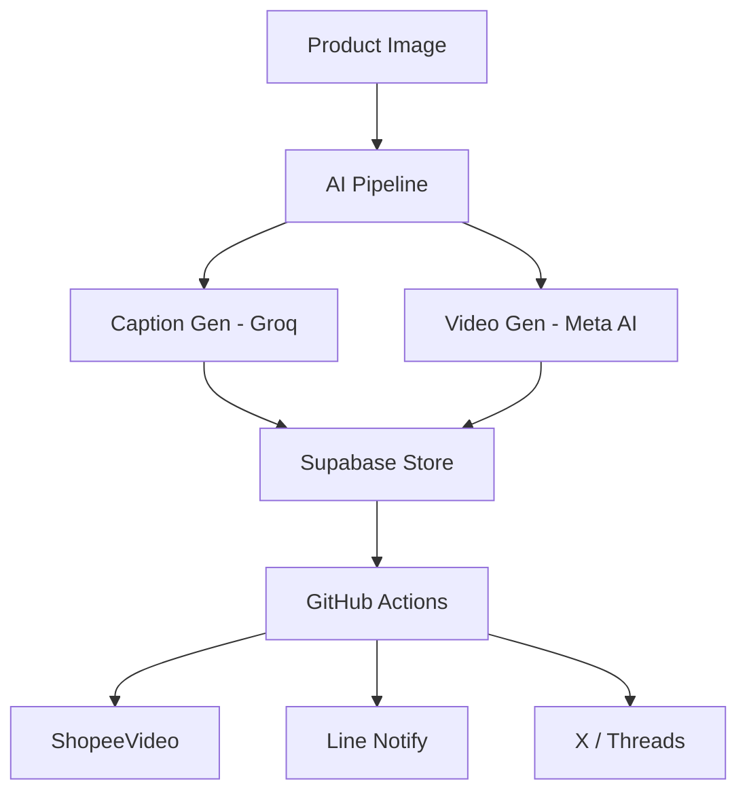

🤝 Contributing to CrystalCastle

Thank you for your interest in contributing! This project is designed to scale with both human and AI-assisted development workflows.

---

🧭 Development Philosophy

- Keep changes small and focused
- Prefer clarity over cleverness
- All features must be testable and documented
- AI-generated code is allowed, but must be reviewed

---

🚀 Getting Started

1. Fork the repository

Click "Fork" on GitHub and clone your fork:

git clone https://github.com/YOUR_USERNAME/crystalcastle.git
cd crystalcastle

---

2. Create a branch

git checkout -b feature/your-feature-name

Branch naming:

- "feature/..."
- "fix/..."
- "chore/..."

---

3. Install dependencies

npm install

---

4. Run the project

npm run dev

---

🧪 Testing

Run tests before submitting:

npm run test

Rules:

- New features must include tests
- Bug fixes must include regression tests

---

✍️ Commit Guidelines

Use Conventional Commits:

feat: add login system
fix: resolve API timeout issue
chore: update dependencies

---

🔁 Pull Request Process

Before submitting:

- [ ] Code builds successfully
- [ ] Tests pass
- [ ] No sensitive data included
- [ ] PR description is clear

PR must include:

- What changed
- Why it changed
- Screenshots (if UI)

---

🤖 AI-Assisted Contributions

AI tools (e.g., ChatGPT, Copilot) are welcome.

But you MUST:

- Review all generated code
- Remove unnecessary complexity
- Ensure security best practices

---

🐛 Reporting Issues

Use GitHub Issues for:

- Bugs
- Feature requests

For security issues:
👉 DO NOT open a public issue
👉 Contact maintainers privately

---

🧼 Code Style

- Use consistent formatting
- Avoid unused code
- Keep functions small and readable

---

❤️ Community

Be respectful. Constructive feedback only.

---

🔥 Maintainer Notes

Maintainers may:

- Request changes
- Reject low-quality PRs
- Refactor submitted code

---

Thank you for helping build CrystalCastle 🚀

