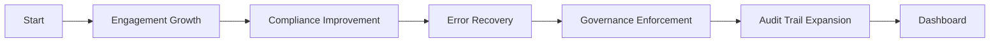

<div align="center">


# 🏰 CrystalCastle
> Open Source Workflow Automation System

[]()
[]()
[]()
[]()
[]()
[]()

<!-- Community Badges -->
[]()
[]()
[]()
---

## 📖 Overview / ภาพรวม

CrystalCastle เป็นระบบ Workflow Automation และ Governance สำหรับทีม Dev ที่ต้องการ:
- ควบคุม CI/CD อัตโนมัติ
- ตรวจสอบ PR และ Permissions อย่างเข้มงวด
- เก็บ Audit Trail ทั้งภาษาไทยและอังกฤษ

---

## 🚀 Features / ฟีเจอร์หลัก

| ฟีเจอร์ | รายละเอียด |
|--------|------------|
| ⚙️ CI/CD Automation | GitHub Actions + Vercel deploy triggers |
| 🔍 Reviewer Cockpit | Notes, Rules, Checklist, Flow, Audit, Actions |
| 🔒 Permissions Governance | Auto revert → read-all หลัง merge |
| 📋 Audit Trail | บันทึก Log สองภาษา TH/EN พร้อม severity matrix |
| 📦 Modular Docs | ชุดเอกสารครบวงจรสำหรับทีม |
| 🤝 Contributor Pack | CONTRIBUTING.md, PR Template, CODE_OF_CONDUCT.md |

---

## 📦 Installation / การติดตั้ง

```bash
git clone https://github.com/1napz/crystalcastle.git
cd crystalcastle
npm ci
```
## 💾- (Local Excel export)

สำหรับกรณีที่ต้องการให้ระบบสร้างไฟล์สำรองเป็น **Excel (.xlsx)** เก็บไว้บนเครื่อง (ผู้ดูแลจะดาวน์โหลดไปอัปโหลดขึ้นคลาวด์เอง) ให้ใช้สคริปต์ตัวอย่างด้านล่าง

### แนวคิด
- สคริปต์จะรวมข้อมูลเป็น CSV → แปลงเป็น XLSX ด้วย `pandas` → เก็บไว้ที่โฟลเดอร์ปลายทาง
- ไม่อัปโหลดไฟล์ใด ๆ อัตโนมัติ เพื่อให้ผู้ดูแลดาวน์โหลดและจัดเก็บบนคลาวด์ของตนเอง
- ตั้ง retention เพื่อลบไฟล์เก่าอัตโนมัติ

### Dependencies
- `jq` (ถ้าต้องแปลง JSON → CSV)
- Python 3 + `pandas`, `openpyxl`

ติดตั้ง:
```bash
sudo apt update
sudo apt install -y jq
pip3 install pandas openpyxl

### 🔧 Environment Variables


---

## 📂 Project Structure / โครงสร้างโปรเจกต์

```
crystalcastle/
├── 📁 Package/           — เอกสารหลัก (README, LICENSE, CHANGELOG ฯลฯ)
├── 📁 docs/              — Release notes และเอกสารเพิ่มเติม
├── 📁 reviewer/          — Reviewer Cockpit ทั้งหมด
│   ├── reviewer.notes.md
│   ├── reviewer.rules.md
│   ├── reviewer.checklist.md
│   ├── reviewer.flow.md
│   ├── reviewer.audit.md
│   └── reviewer.actions.md
├── 📁 src/               — Source code หลัก
├── 📁 api/               — API handlers
├── 📁 Frontend/          — Frontend assets
├── 📁 scripts/           — Automation scripts
└── 📁 logs/              — Audit logs
```

---

## 👥 Contributor Workflow / ขั้นตอนการร่วมพัฒนา

```
Fork → Clone → Branch → Commit → Pull Request → Review → Merge
```

1. **Fork & Clone** — ทำงานบน branch ของคุณ
2. **Commit** — ใช้ bilingual commit message + checklist
3. **Pull Request** — ต้องผ่าน reviewer/admin ก่อน merge
4. **Governance** — `.coderabbit.yaml` ตรวจสอบอัตโนมัติ
5. **Merge** → Permissions revert → Audit trail update

---

## 📊 Governance Flow

```
Merge PR
   │
   ▼
Permissions Revert (read-all)
   │
   ▼
Audit Trail Update (TH/EN logs)
   │
   ▼
Reviewer Cockpit (Notes + Rules + Checklist)
```

```
Log Correct    → Approve  → Continue Review
Log Incorrect  → Fix      → Block Merge
Severity High  → Escalate → Stop Merge
```

---

## 📈 Performance Progression



---

## 🔒 Security / ความปลอดภัย

- **RBAC** — reviewer / admin / agent แยกสิทธิ์ชัดเจน
- **MFA** — แนะนำให้เปิดใช้งานทุกบัญชี
- **Audit Trail** — ทุก commit/test/deploy มี log ย้อนหลังได้
- **Secret Scan** — ตรวจสอบ secrets อัตโนมัติทุก push

ดูนโยบายความปลอดภัยเพิ่มเติมที่ [SECURITY.md](./SECURITY.md)

---

## 📑 Quick Links / ลิงก์ด่วน

- 📝 [Reviewer Notes](./reviewer/reviewer.notes.md)
- 📏 [Reviewer Rules](./reviewer/reviewer.rules.md)
- ✅ [Reviewer Checklist](./reviewer/reviewer.checklist.md)
- 🔄 [Reviewer Flow](./reviewer/reviewer.flow.md)
- 📇 [Reviewer Index](./reviewer/reviewer.index.md)
- 🔍 [Reviewer Audit](./reviewer/reviewer.audit.md)
- ⚡ [Reviewer Actions](./reviewer/reviewer.actions.md)
- 📋 [CHANGELOG](./CHANGELOG.md)
- 🤝 [CONTRIBUTING](./CONTRIBUTING.md)

---

## 📬 Contact / ติดต่อ

- **Admin:** nobizzmaru@gmail.com
- **Website:** [1napz.github.io/crystalcastle](https://1napz.github.io/crystalcastle/)
- **Issues:** [GitHub Issues](https://github.com/1napz/crystalcastle/issues)

---

## 📜 License

MIT License © [1napz](https://github.com/1napz) — ดูรายละเอียดที่ [LICENSE](./LICENSE)


## 🔄 Governance – Auto PR Description

CrystalCastle enforces **automated PR metadata** as part of CI/CD governance:

- **Commit Messages** → must follow Conventional Commit rules (`feat:`, `fix:`, `docs:`, `chore:`).  
- **PR Titles** → auto‑set from the first commit subject if missing.  
- **PR Descriptions** → auto‑scaffolded with:
  - Bilingual summary (EN/TH)
  - Commit history under “Changes”
  - Governance checklist (tests, docs, AI cost validation)
  - Issue reference placeholder
  - Notes section for workflow governance

### 📌 Example Auto‑Generated PR Description

```markdown
## 🚀 Pull Request

### 📌 Summary / สรุป
- EN: Auto-generated summary based on commit history
- TH: สรุปอัตโนมัติจาก commit

---

### 🔄 Changes (Commits)
- feat: add reviewer checklist
- fix: CI pipeline lint errors
- docs: update README governance section

---

### ✅ Pre-Merge Checklist
- [ ] Feature works as expected
- [ ] Tests added/updated
- [ ] Docs updated
- [ ] AI cost validated

---

### 🔎 Issue Reference
- Related: #<issue-number>

---

### 📝 Notes
workflow already merged from crystalcastle/workflows to .github/workflows

🗺️ Roadmap / Milestones

CrystalCastle มีแผนพัฒนาเป็นขั้นตอน โดยใช้ GitHub Milestones เพื่อจัดการงานและติดตามความคืบหน้า:

📌 Milestones ที่วางไว้
- v1.0 – Core Automation
  - CI/CD Workflow (Build → Test → Deploy)
  - Reviewer Cockpit
  - Permissions Governance
  - Audit Trail (TH/EN)

- v1.1 – Security Expansion
  - CodeQL Integration
  - Secret Scan
  - MFA Recommendation
  - RBAC (Reviewer / Admin / Agent)

- v1.2 – Contributor Experience
  - Contributor Pack
  - Modular Docs
  - Reviewer Notes & Rules
  - CHANGELOG Automation

- v2.0 – Dashboard & Analytics
  - Performance Progression Dashboard
  - Compliance Metrics
  - Error Recovery Flow
  - Governance Enforcement Visualization

---

📊 Progression Diagram
`mermaid
graph LR
A[Start] --> B[Engagement Growth]
B --> C[Compliance Improvement]
C --> D[Error Recovery]
D --> E[Governance Enforcement]
E --> F[Audit Trail Expansion]
F --> G[Dashboard]
`

---
