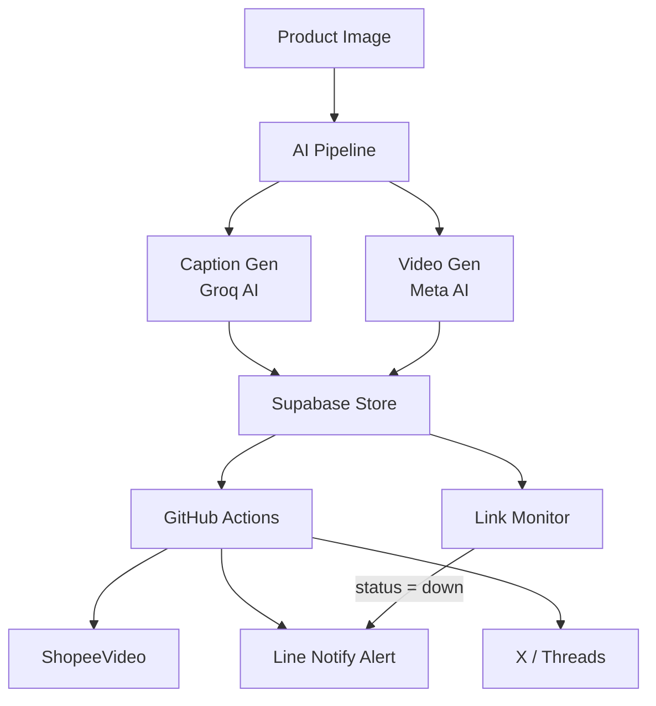

# ✦ Crystal Castle — Reviewer Checklist

> ใช้ checklist นี้ทุกครั้งก่อน merge PR เข้า `main`
> Use this checklist before every merge to `main`.

---

## 🔐 Security

- [ ] ไม่มี hardcoded secrets, API keys, หรือ tokens ในโค้ด
- [ ] ทุก credential ผ่าน **GitHub Secrets** เท่านั้น
- [ ] ไม่มี `.env` ไฟล์ถูก commit เข้า repo
- [ ] `SUPABASE_KEY` ใช้ Service Role Key (ไม่ใช่ anon key) สำหรับ server-side

---

## 🐍 Python Code Quality

- [ ] โค้ดตาม **PEP8** standard
- [ ] ทุก HTTP call มี `try/except` ครอบ
- [ ] ไม่มี `print()` debug statements เหลืออยู่ (ใช้ `logging` แทน)
- [ ] Function มี docstring อธิบายสั้นๆ
- [ ] ไม่มี mutable default arguments (`def f(x=[])`)

---

## 🧪 Testing

- [ ] `src/services/api.test.js` ผ่านทั้งหมด — **0 failing tests**
- [ ] Test coverage ≥ **90%**
- [ ] Supabase calls ถูก mock ใน test environment
- [ ] ENV variables มีใน `.env.test` หรือ test secrets

---

## 🔗 Affiliate Links & Supabase

- [ ] `upsert_link()` ทำงานถูกต้องกับ Supabase `affiliate_links` table
- [ ] `update_status()` บันทึก log ลง `link_monitor_log` table
- [ ] Response code ที่ไม่ใช่ `200` ถูก handle เป็น `"down"`
- [ ] ไม่มี affiliate URL ถูก hardcode — ต้องอยู่ใน Supabase เท่านั้น

---

## ⚙️ GitHub Actions & CI/CD

- [ ] Workflow ผ่านทุก job ก่อน merge
- [ ] `monitor.yml` — scheduled trigger ตั้งถูกต้อง
- [ ] `ai_pipeline.yml` — ไม่มี API key exposed ใน logs
- [ ] Deploy ไป GitHub Pages สำเร็จ (ถ้า PR เกี่ยวกับ frontend)

---

## 📄 Documentation

- [ ] `CONTRIBUTING.md` อัปเดตถ้ามีการเปลี่ยน workflow
- [ ] `docs/logs/index.md` — เพิ่ม log entry สำหรับการเปลี่ยนแปลงสำคัญ
- [ ] **Mermaid Diagram render ได้ถูกต้อง** (ถ้ามีใน PR)
- [ ] `README.md` สอดคล้องกับ code จริง

---

## 🎨 Content & Platform

- [ ] Caption ใช้ brand voice: **Trendy · Minimalist · Authoritative**
- [ ] Image/Video prompt ระบุ aspect ratio ถูกต้อง (9:16 / 1:1 / 16:9)
- [ ] Hashtag ไม่เกิน 3 ตัวต่อ post
- [ ] ไม่มี affiliate link ตรงๆ ใน caption — ใช้ link-in-bio เสมอ

---

## 🌐 Infrastructure & Domain

- [ ] DNS records ของ `zyntro-media.art` ไม่ถูกแตะโดยไม่ตั้งใจ
- [ ] Vercel deployment สำเร็จและ domain valid
- [ ] Line Notify token ยังไม่หมดอายุ
- [ ] Supabase free tier ยังไม่เกิน limit (500MB / 2M rows)

---

## 🏗️ Architecture Diagram

---

## ✅ Final Sign-off

| Check | Status |
|-------|--------|
| Security review | ☐ |
| Tests passing | ☐ |
| Docs updated | ☐ |
| Diagram renders | ☐ |
| Ready to merge | ☐ |

**Reviewed by:** _______________
**Date:** _______________

---

*Crystal Castle · Maintained by 1napz · [Knowledge Log](docs/logs/index.md)*
