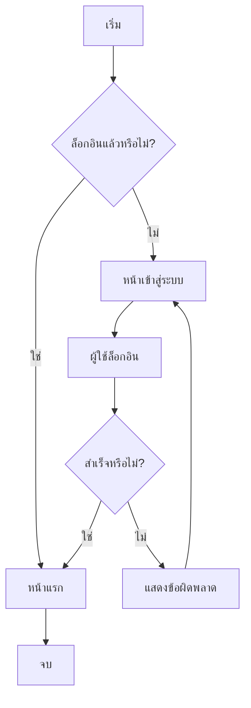
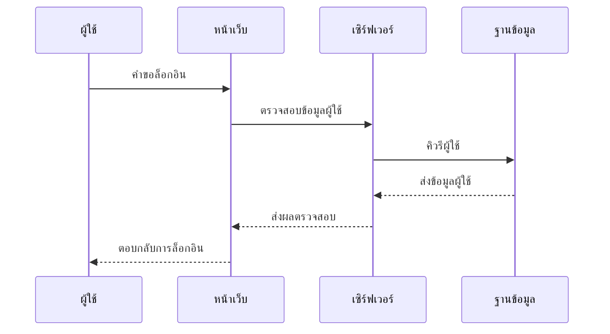
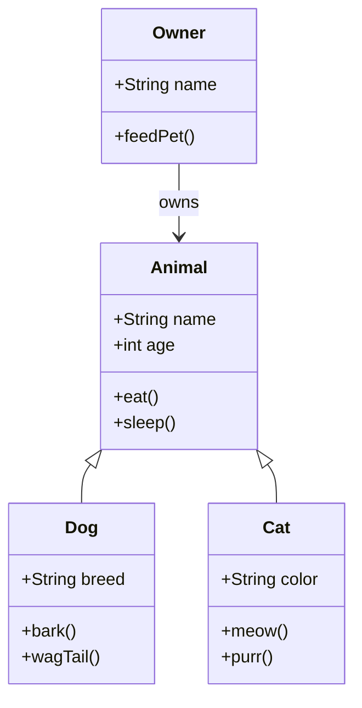
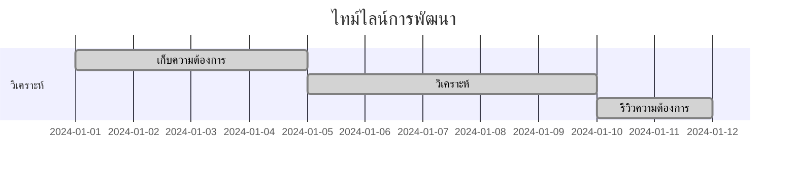
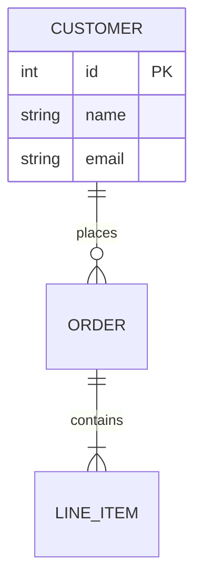
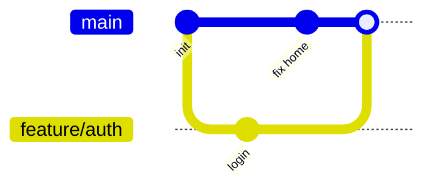
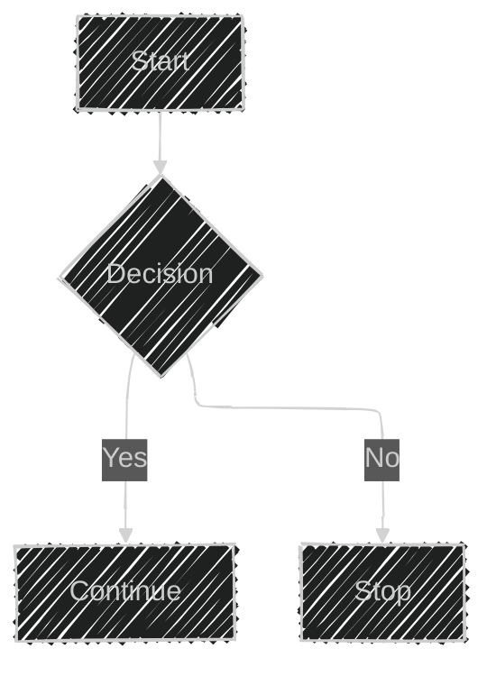
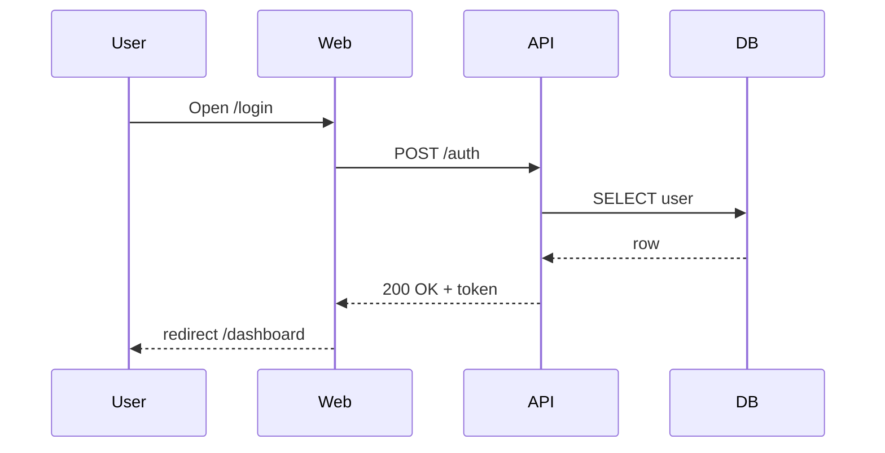

# รายงานการค้นคว้า: Mermaid Diagram — ภาพรวม การใช้งานจริง และการเปรียบเทียบกับ PlantUML และ Draw.io

---

## บทนำ

ในยุคที่การสื่อสารข้อมูลเชิงโครงสร้างและกระบวนการเป็นสิ่งสำคัญสำหรับการพัฒนาโครงการซอฟต์แวร์ การวางแผนโครงการ และการจัดทำเอกสารประกอบ การสร้างไดอะแกรม (Diagram) กลายเป็นเครื่องมือหลักที่ช่วยให้ทีมงานและผู้มีส่วนเกี่ยวข้องเข้าใจระบบหรือกระบวนการได้อย่างรวดเร็วและแม่นยำ Mermaid Diagram คือหนึ่งในเครื่องมือสร้างไดอะแกรมที่ได้รับความนิยมอย่างสูงในกลุ่มนักพัฒนาและผู้จัดทำเอกสารยุคใหม่ ด้วยแนวคิด "เขียนโค้ดเพื่อสร้างภาพ" ที่เน้นความเรียบง่ายและการผสานรวมกับแพลตฟอร์มต่าง ๆ โดยเฉพาะ Markdown และระบบควบคุมเวอร์ชัน เช่น GitHub

รายงานฉบับนี้จะนำเสนอภาพรวมของ Mermaid Diagram ตั้งแต่แนวคิด วิธีการทำงาน ไวยากรณ์ ตัวอย่างการใช้งานจริง จุดเด่น ข้อจำกัด ไปจนถึงการเปรียบเทียบกับเครื่องมือสร้างไดอะแกรมยอดนิยมอื่น ๆ อย่าง PlantUML และ Draw.io พร้อมตารางเปรียบเทียบที่ชัดเจน รวมถึงแนวปฏิบัติที่ดีและประเด็นด้านความปลอดภัย เพื่อให้ผู้อ่านสามารถเลือกใช้เครื่องมือที่เหมาะสมกับบริบทงานของตนเองได้อย่างมีประสิทธิภาพ

---

## ภาพรวมของ Mermaid Diagram

### Mermaid Diagram คืออะไร

**Mermaid Diagram** คือเครื่องมือสร้างไดอะแกรมและแผนภูมิแบบ text-based ที่ใช้ไวยากรณ์คล้าย Markdown เพื่อแปลงข้อความเป็นภาพไดอะแกรมโดยอัตโนมัติ จุดเด่นของ Mermaid คือความสามารถในการฝังโค้ดไดอะแกรมลงในเอกสาร Markdown หรือแพลตฟอร์มที่รองรับ เช่น GitHub, GitLab, Notion, VitePress, Obsidian และอื่น ๆ โดยไม่ต้องใช้โปรแกรมกราฟิกหรือเครื่องมือแบบลากและวาง (drag-and-drop)[43dcd9a7-70db-4a1f-b0ae-981daa162054](https://mermaid.js.org/?citationMarker=43dcd9a7-70db-4a1f-b0ae-981daa162054 "1")[43dcd9a7-70db-4a1f-b0ae-981daa162054](https://mermaideditor.com/th?citationMarker=43dcd9a7-70db-4a1f-b0ae-981daa162054 "2").

แนวคิดหลักของ Mermaid คือการทำให้การสร้างและดูแลไดอะแกรมเป็นเรื่องง่าย รวดเร็ว และเหมาะกับการทำงานร่วมกับระบบควบคุมเวอร์ชัน (version control) เช่น Git ซึ่งช่วยให้สามารถติดตามการเปลี่ยนแปลงของไดอะแกรมได้เหมือนกับโค้ดโปรแกรม

Mermaid ได้รับรางวัล JavaScript Open Source Award ในปี 2019 สาขา "The Most Exciting Use of Technology" และมีการพัฒนาอย่างต่อเนื่องโดยชุมชนโอเพนซอร์สขนาดใหญ่[43dcd9a7-70db-4a1f-b0ae-981daa162054](https://mermaid.js.org/?citationMarker=43dcd9a7-70db-4a1f-b0ae-981daa162054 "1").

---

### จุดเด่นและความสำคัญของ Mermaid

- **สร้างไดอะแกรมได้รวดเร็วและง่ายดาย**: Mermaid ใช้ไวยากรณ์ที่เข้าใจง่าย ไม่ต้องใช้เครื่องมือกราฟิกซับซ้อน
- **ผสานรวมกับแพลตฟอร์มยอดนิยม**: รองรับการฝังใน GitHub, GitLab, Notion, Obsidian, VitePress ฯลฯ
- **เหมาะกับงานที่ต้องปรับปรุงไดอะแกรมบ่อย ๆ**: การแก้ไขไดอะแกรมทำได้เหมือนแก้ไขโค้ด
- **เหมาะกับการทำงานร่วมกันในทีม**: ไดอะแกรมเป็น text-based สามารถใช้ Git diff และ pull request ได้
- **ฟรีและโอเพนซอร์ส**: ใช้ได้โดยไม่มีค่าใช้จ่าย และสามารถปรับแต่งหรือขยายฟีเจอร์ได้ตามต้องการ[43dcd9a7-70db-4a1f-b0ae-981daa162054](https://mermaideditor.com/th?citationMarker=43dcd9a7-70db-4a1f-b0ae-981daa162054 "2")[43dcd9a7-70db-4a1f-b0ae-981daa162054](https://mermaid.js.org/?citationMarker=43dcd9a7-70db-4a1f-b0ae-981daa162054 "1").

---

## ไวยากรณ์พื้นฐานและตัวอย่างโค้ด

### โครงสร้างไวยากรณ์ Mermaid

Mermaid ใช้ไวยากรณ์ที่ประกอบด้วยการระบุประเภทไดอะแกรม (diagram type) ตามด้วยรายละเอียดของโหนด (node) และความสัมพันธ์ (edge) ระหว่างโหนดนั้น ๆ ตัวอย่างเช่น:


ตัวอย่างนี้แสดง flowchart ที่อธิบายขั้นตอนการล็อกอินของผู้ใช้[43dcd9a7-70db-4a1f-b0ae-981daa162054](https://mermaideditor.com/th/cheatsheet?citationMarker=43dcd9a7-70db-4a1f-b0ae-981daa162054 "3")[43dcd9a7-70db-4a1f-b0ae-981daa162054](https://tooltool.net/en/mermaid/tutorial?citationMarker=43dcd9a7-70db-4a1f-b0ae-981daa162054 "4").

---

### ตัวอย่างไวยากรณ์สำหรับไดอะแกรมประเภทต่าง ๆ

- **Sequence Diagram**


- **Class Diagram**


- **Gantt Chart**


- **ER Diagram**


- **Git Graph**


ไวยากรณ์ของ Mermaid มีความยืดหยุ่นสูง สามารถกำหนดรูปร่างโหนด ทิศทางของกราฟ และสไตล์ต่าง ๆ ได้อย่างละเอียด[43dcd9a7-70db-4a1f-b0ae-981daa162054](https://mermaideditor.com/th/cheatsheet?citationMarker=43dcd9a7-70db-4a1f-b0ae-981daa162054 "3")[43dcd9a7-70db-4a1f-b0ae-981daa162054](https://tooltool.net/en/mermaid/tutorial?citationMarker=43dcd9a7-70db-4a1f-b0ae-981daa162054 "4")[43dcd9a7-70db-4a1f-b0ae-981daa162054](https://mermaid.ai/open-source/syntax/flowchart.html?citationMarker=43dcd9a7-70db-4a1f-b0ae-981daa162054 "5").

---

## ประเภทของไดอะแกรมที่รองรับ

Mermaid รองรับไดอะแกรมหลากหลายประเภท ครอบคลุมทั้งงานด้านซอฟต์แวร์ การบริหารโครงการ UX และการวิเคราะห์ข้อมูล

| ประเภทไดอะแกรม           | คำอธิบาย/การใช้งานหลัก                                  |
|--------------------------|--------------------------------------------------------|
| Flowchart                | ผังงาน, เวิร์กโฟลว์, อัลกอริทึม, การตัดสินใจ          |
| Sequence Diagram         | ลำดับเหตุการณ์, การโต้ตอบระหว่างระบบ/ผู้ใช้            |
| Class Diagram            | โครงสร้างคลาส, OOP, สถาปัตยกรรมซอฟต์แวร์             |
| State Diagram            | การเปลี่ยนสถานะ, วงจรชีวิต, เวิร์กโฟลว์                 |
| Gantt Chart              | การวางแผนโครงการ, ไทม์ไลน์, การติดตามงาน                |
| Entity-Relationship (ER) | การออกแบบฐานข้อมูล, ความสัมพันธ์ระหว่างเอนทิตี         |
| User Journey             | แผนที่ประสบการณ์ผู้ใช้, UX, Customer Journey           |
| Git Graph                | เวิร์กโฟลว์ Git, ประวัติคอมมิต, การแตกสาขา              |
| Mindmap                  | แผนที่ความคิด, การระดมสมอง, การจัดโครงสร้างความรู้      |
| Pie Chart                | แผนภูมิวงกลม, การเปรียบเทียบสัดส่วน                    |
| Timeline                 | ไทม์ไลน์เหตุการณ์, Roadmap, ประวัติโครงการ              |
| Kanban                   | บอร์ดงาน, Agile, การติดตามสถานะงาน                      |
| Quadrant Chart           | การวิเคราะห์เชิงกลยุทธ์, การจัดลำดับความสำคัญ           |
| Sankey Diagram           | การไหลของข้อมูล/พลังงาน, Funnel, การจัดสรรงบประมาณ      |
| XY Chart                 | แผนภูมิแท่ง, แผนภูมิเส้น, การวิเคราะห์แนวโน้ม          |
| Block Diagram            | สถาปัตยกรรมระบบ, การจัดวางส่วนประกอบ                    |
| Architecture Diagram     | สถาปัตยกรรมคลาวด์, โครงสร้างพื้นฐาน                    |
| Packet Diagram           | โครงสร้างแพ็กเก็ตเครือข่าย, โปรโตคอล                    |
| Requirement Diagram      | การจัดการความต้องการ, การวิเคราะห์ระบบ                  |
| Radar, Venn, Tree, Treemap, Ishikawa, C4 | ไดอะแกรมเฉพาะทางอื่น ๆ (บางประเภท experimental) |

Mermaid มีการขยายประเภทไดอะแกรมอย่างต่อเนื่อง โดยในปี 2026 มีไดอะแกรมใหม่ ๆ เช่น Sankey, XY, Block, Architecture, Packet, Quadrant, Kanban, Timeline, Mindmap, Radar, Venn, Tree, Treemap, Ishikawa, C4 เป็นต้น[43dcd9a7-70db-4a1f-b0ae-981daa162054](https://mermaideditor.com/th/cheatsheet?citationMarker=43dcd9a7-70db-4a1f-b0ae-981daa162054 "3")[43dcd9a7-70db-4a1f-b0ae-981daa162054](https://mermaid.ai/open-source/syntax/flowchart.html?citationMarker=43dcd9a7-70db-4a1f-b0ae-981daa162054 "5")[43dcd9a7-70db-4a1f-b0ae-981daa162054](https://mermaideditor.com/blog/mermaid-vs-drawio-2026?citationMarker=43dcd9a7-70db-4a1f-b0ae-981daa162054 "6")[43dcd9a7-70db-4a1f-b0ae-981daa162054](https://mermaid.js.org/?citationMarker=43dcd9a7-70db-4a1f-b0ae-981daa162054 "1").

---

### การเลือกประเภทไดอะแกรมที่เหมาะสม

การเลือกประเภทไดอะแกรมขึ้นอยู่กับวัตถุประสงค์ของการนำเสนอข้อมูล เช่น หากต้องการอธิบายลำดับเหตุการณ์ควรใช้ Sequence Diagram หากต้องการแสดงโครงสร้างฐานข้อมูลควรใช้ ER Diagram หรือหากต้องการวางแผนโครงการควรใช้ Gantt Chart เป็นต้น

---

## การเรนเดอร์และการทำงานภายใน (Rendering Engine)

### สถาปัตยกรรมการเรนเดอร์ของ Mermaid

Mermaid ทำงานโดยใช้ JavaScript Library (mermaid.js) ที่แปลงโค้ดไวยากรณ์ Mermaid เป็น SVG หรือ HTML Canvas เพื่อแสดงผลไดอะแกรมในเบราว์เซอร์หรือแพลตฟอร์มที่รองรับ

- **Rendering Engine หลัก**: Dagre (default) — เหมาะกับไดอะแกรมทั่วไป เช่น flowchart, state diagram
- **Rendering Engine ทางเลือก**: ELK (Eclipse Layout Kernel) — เหมาะกับไดอะแกรมขนาดใหญ่หรือซับซ้อน ให้เลย์เอาต์ที่แม่นยำและปรับแต่งได้มากขึ้น (ต้องเปิดใช้งานเพิ่มเติม)[43dcd9a7-70db-4a1f-b0ae-981daa162054](https://mermaid.ai/open-source/intro/syntax-reference.html?citationMarker=43dcd9a7-70db-4a1f-b0ae-981daa162054 "7")[43dcd9a7-70db-4a1f-b0ae-981daa162054](https://mermaid.ai/open-source/syntax/flowchart.html?citationMarker=43dcd9a7-70db-4a1f-b0ae-981daa162054 "5")

ผู้ใช้สามารถเลือก layout algorithm และ look (เช่น hand-drawn, classic) ได้ผ่าน frontmatter หรือ config object



การเรนเดอร์ของ Mermaid สามารถทำได้ทั้งฝั่ง client (เบราว์เซอร์) และ server (ผ่าน Node.js หรือ CLI) ทำให้เหมาะกับการผสานใน CI/CD pipeline หรือการสร้างภาพอัตโนมัติในระบบเอกสาร[43dcd9a7-70db-4a1f-b0ae-981daa162054](https://deepwiki.com/mermaid-js/mermaid/4.3-cicd-pipeline?citationMarker=43dcd9a7-70db-4a1f-b0ae-981daa162054 "8").

---

### การฝังใน Markdown และแพลตฟอร์มต่าง ๆ

Mermaid สามารถฝังใน Markdown ได้โดยใช้ code block ที่ระบุ language เป็น `mermaid` เช่น

````markdown

````

แพลตฟอร์มที่รองรับการเรนเดอร์ Mermaid โดยตรง ได้แก่

- **GitHub**: README, Issues, Pull Requests, Discussions, Wiki
- **GitLab**: README, Wiki, Issues, Merge Requests
- **Notion**: Block Mermaid
- **VitePress, Docusaurus, Astro, Mintlify**: เอกสารเทคนิค
- **Obsidian, Linear, Discord**: ผ่านปลั๊กอินหรือ native support
- **Draw.io**: สามารถแทรก Mermaid code เพื่อสร้างไดอะแกรมอัตโนมัติใน canvas[43dcd9a7-70db-4a1f-b0ae-981daa162054](https://mermaideditor.com/th?citationMarker=43dcd9a7-70db-4a1f-b0ae-981daa162054 "2")[43dcd9a7-70db-4a1f-b0ae-981daa162054](https://www.drawio.com/blog/mermaid-diagrams?citationMarker=43dcd9a7-70db-4a1f-b0ae-981daa162054 "9")[43dcd9a7-70db-4a1f-b0ae-981daa162054](https://mermaideditor.com/blog/mermaid-vs-drawio-2026?citationMarker=43dcd9a7-70db-4a1f-b0ae-981daa162054 "6")

---

## ตัวอย่างการใช้งานจริง

### การใช้งานใน GitHub

**GitHub** รองรับ Mermaid โดยตรงใน Markdown file, README, Issues, Pull Requests และ Discussions ผู้ใช้สามารถแทรกโค้ด Mermaid ใน code block แล้ว GitHub จะเรนเดอร์เป็นไดอะแกรมอัตโนมัติ

ตัวอย่างการใช้งานใน README:

````markdown
# ระบบล็อกอิน


````

ใน Issues หรือ Pull Requests สามารถใช้ Mermaid เพื่ออธิบาย flow ของ bug, feature, หรือการเปลี่ยนแปลงโค้ดได้อย่างชัดเจน และสามารถ review diff ของไดอะแกรมได้เหมือนกับโค้ดโปรแกรม[43dcd9a7-70db-4a1f-b0ae-981daa162054](https://github.com/mermaid-js/mermaid/blob/develop/README.md?citationMarker=43dcd9a7-70db-4a1f-b0ae-981daa162054 "10")[43dcd9a7-70db-4a1f-b0ae-981daa162054](https://mermaideditor.com/blog/mermaid-vs-drawio-2026?citationMarker=43dcd9a7-70db-4a1f-b0ae-981daa162054 "6").

---

### การใช้งานใน Knowledge Hub และแหล่งความรู้ไทย

**NSTDA Knowledge Hub** และแหล่งความรู้ด้านเทคโนโลยีในไทย เช่น nstda.or.th, markdownlang.com, mermaideditor.com มีการนำ Mermaid มาใช้สร้างไดอะแกรมในบทความ คู่มือ และเอกสารประกอบโครงการ เพื่ออธิบายกระบวนการทางธุรกิจ สถาปัตยกรรมระบบ หรือการออกแบบฐานข้อมูล[43dcd9a7-70db-4a1f-b0ae-981daa162054](https://mermaideditor.com/th?citationMarker=43dcd9a7-70db-4a1f-b0ae-981daa162054 "2").

ตัวอย่างเช่น การสร้าง flowchart อธิบายขั้นตอนการขออนุญาตทำงานของคนต่างด้าว หรือการวางแผนโครงการวิจัยด้วย Gantt Chart

---

### การใช้งานในเอกสารประกอบโครงการและเอกสารสถาปัตยกรรม

Mermaid ถูกนำไปใช้ในเอกสารสถาปัตยกรรมซอฟต์แวร์ (Software Architecture Document), API Documentation, Onboarding Guide, Roadmap, และเอกสารประกอบโครงการต่าง ๆ โดยเฉพาะในองค์กรที่ใช้ Git เป็นศูนย์กลางการทำงาน

ตัวอย่างการใช้งาน:

- **Roadmap Generator**: โครงการโอเพนซอร์สที่ใช้ Mermaid.js สร้าง Roadmap Diagram อัตโนมัติจากคำอธิบาย text-based[43dcd9a7-70db-4a1f-b0ae-981daa162054](https://github.com/mcrai-dev/Roadmap-Generator?citationMarker=43dcd9a7-70db-4a1f-b0ae-981daa162054 "11")
- **CI/CD Pipeline Diagram**: ใช้ Mermaid อธิบายขั้นตอนการ deploy โค้ดจาก commit ไป production ใน DevOps pipeline[43dcd9a7-70db-4a1f-b0ae-981daa162054](https://mermaid.ai/community/templates/ci-cd-pipeline-diagram?citationMarker=43dcd9a7-70db-4a1f-b0ae-981daa162054 "12")[43dcd9a7-70db-4a1f-b0ae-981daa162054](https://deepwiki.com/mermaid-js/mermaid/4.3-cicd-pipeline?citationMarker=43dcd9a7-70db-4a1f-b0ae-981daa162054 "8")

---

## จุดเด่นของ Mermaid

### 1. ความเรียบง่ายและเรียนรู้ได้เร็ว

Mermaid ใช้ไวยากรณ์ที่คล้าย Markdown หรือภาษาโปรแกรมเชิงโครงสร้าง ทำให้ผู้ใช้ที่คุ้นเคยกับ Markdown หรือโค้ดสามารถเริ่มต้นใช้งานได้ภายในเวลาไม่กี่นาที ไม่ต้องเรียนรู้เครื่องมือกราฟิกใหม่ ๆ[43dcd9a7-70db-4a1f-b0ae-981daa162054](https://gleek.io/blog/mermaid-vs-plantuml?citationMarker=43dcd9a7-70db-4a1f-b0ae-981daa162054 "13")[43dcd9a7-70db-4a1f-b0ae-981daa162054](https://www.unidiagram.com/blog/mermaid-vs-plantuml-comparison?citationMarker=43dcd9a7-70db-4a1f-b0ae-981daa162054 "14").

### 2. เหมาะกับการควบคุมเวอร์ชัน (Version Control)

ไดอะแกรมของ Mermaid เป็น text-based สามารถเก็บใน Git, review diff, ทำ pull request, และ merge ได้เหมือนโค้ดโปรแกรม ช่วยให้ทีมงานสามารถติดตามการเปลี่ยนแปลงและแก้ไขข้อขัดแย้งได้อย่างมีประสิทธิภาพ

### 3. ผสานรวมกับแพลตฟอร์มยอดนิยม

Mermaid รองรับ native rendering ใน GitHub, GitLab, Notion, Obsidian, VitePress, Docusaurus, Linear, Discord และอื่น ๆ โดยไม่ต้องติดตั้งปลั๊กอินเพิ่มเติม

### 4. รองรับไดอะแกรมหลากหลายประเภท

Mermaid รองรับไดอะแกรมมากกว่า 15 ประเภท ครอบคลุมทั้ง flowchart, sequence, class, ER, Gantt, mindmap, kanban, timeline, sankey, architecture, packet, quadrant, XY chart ฯลฯ

### 5. เหมาะกับการทำงานร่วมกันในทีม

การแก้ไขไดอะแกรมทำได้เหมือนแก้ไขโค้ด สามารถ review, comment, และ merge ได้ใน workflow เดียวกับโค้ดโปรแกรม

### 6. ฟรีและโอเพนซอร์ส

Mermaid ใช้สัญญาอนุญาตแบบ MIT สามารถใช้งานได้ฟรีทั้งในเชิงพาณิชย์และส่วนบุคคล และมีชุมชนผู้ใช้และนักพัฒนาขนาดใหญ่[43dcd9a7-70db-4a1f-b0ae-981daa162054](https://mermaid.js.org/?citationMarker=43dcd9a7-70db-4a1f-b0ae-981daa162054 "1")[43dcd9a7-70db-4a1f-b0ae-981daa162054](https://mermaideditor.com/th?citationMarker=43dcd9a7-70db-4a1f-b0ae-981daa162054 "2")

### 7. สนับสนุนการสร้างภาพอัตโนมัติ (Automation)

สามารถผสานกับ CI/CD pipeline เพื่อสร้างหรืออัปเดตไดอะแกรมอัตโนมัติจากโค้ดหรือข้อมูลจริงได้

---

## ข้อจำกัดและปัญหาที่พบบ่อย

### 1. การควบคุมเลย์เอาต์และตำแหน่ง

Mermaid ใช้ layout algorithm อัตโนมัติ (Dagre, ELK) ทำให้ไม่สามารถควบคุมตำแหน่งของโหนดหรือเส้นเชื่อมได้ละเอียดเท่าเครื่องมือแบบลากและวาง เช่น Draw.io หากต้องการ pixel-perfect layout หรือการจัดวางที่ซับซ้อน Mermaid อาจไม่ตอบโจทย์[43dcd9a7-70db-4a1f-b0ae-981daa162054](https://simplemermaid.com/blog/mermaid-vs-drawio.html?citationMarker=43dcd9a7-70db-4a1f-b0ae-981daa162054 "15")[43dcd9a7-70db-4a1f-b0ae-981daa162054](https://mermaideditor.com/blog/mermaid-vs-drawio-2026?citationMarker=43dcd9a7-70db-4a1f-b0ae-981daa162054 "6")

### 2. การปรับแต่งรูปลักษณ์และไอคอน

Mermaid มี shape library และไอคอนจำกัด ไม่เหมาะกับงานที่ต้องใช้สัญลักษณ์เฉพาะทาง เช่น AWS, Azure, GCP, network icons หรือ branding เฉพาะองค์กร

### 3. การเรียนรู้สำหรับผู้ไม่ถนัดโค้ด

แม้ไวยากรณ์จะง่ายสำหรับนักพัฒนา แต่สำหรับผู้ใช้ที่ไม่ถนัดโค้ดหรือไม่คุ้นเคยกับ Markdown อาจต้องใช้เวลาในการเรียนรู้

### 4. ข้อจำกัดด้านฟีเจอร์บางประเภท

- Mindmap, C4, Sankey, Architecture, Packet diagram ยังอยู่ในสถานะ experimental หรือมีฟีเจอร์จำกัด
- ไม่รองรับ diagram ประเภท floor plan, wireframe, infographic, หรือ custom shape อิสระเท่า Draw.io

### 5. ปัญหาด้านความปลอดภัย

มีประเด็นด้าน XSS (Cross-site Scripting) หากเรนเดอร์ไดอะแกรมจาก input ของผู้ใช้โดยไม่ sanitization ที่เหมาะสม โดยเฉพาะใน sequence diagram ที่มีการใช้ KaTeX หรือ HTML label[43dcd9a7-70db-4a1f-b0ae-981daa162054](https://github.com/mermaid-js/mermaid/security/advisories/GHSA-7rqq-prvp-x9jh?citationMarker=43dcd9a7-70db-4a1f-b0ae-981daa162054 "16")

### 6. การแปลงหรือย้ายข้อมูลจากเครื่องมืออื่น

การแปลงไดอะแกรมจาก PlantUML หรือ Draw.io มาเป็น Mermaid อาจมีข้อจำกัดด้านฟีเจอร์หรือ syntax ที่ไม่ตรงกัน 100% ต้องตรวจสอบและปรับแต่งโค้ดที่แปลงมา

---

## การเปรียบเทียบ Mermaid กับ PlantUML และ Draw.io

### ภาพรวมการเปรียบเทียบ

| คุณสมบัติหลัก         | Mermaid             | PlantUML             | Draw.io (diagrams.net)    |
|----------------------|---------------------|----------------------|---------------------------|
| วิธีสร้างไดอะแกรม   | Text-based (Markdown-like) | Text-based (Java-like) | Visual drag-and-drop      |
| Learning Curve       | ต่ำ (สำหรับ dev)    | ปานกลาง-สูง         | ต่ำ (สำหรับทุกคน)         |
| Diagram Types        | 15+ (flow, seq, class, ER, Gantt, etc.) | ครบทุก UML, C4, mindmap, WBS, etc. | ไม่จำกัด (freeform)      |
| Layout Control       | อัตโนมัติ (Dagre/ELK) | อัตโนมัติ/ปรับแต่งได้ | Manual, pixel-perfect     |
| Shape/Icon Library   | จำกัด (พื้นฐาน)     | จำกัด (UML-centric)  | มาก (cloud, network, custom) |
| Version Control      | ดีเยี่ยม (text diff) | ดีเยี่ยม (text diff) | ไม่ดี (XML/binary diff)   |
| Platform Integration | GitHub, GitLab, Notion, Obsidian, Docs | Confluence, IntelliJ, etc. | Google Drive, Confluence, etc. |
| Collaboration        | Git workflow        | Git workflow         | Real-time co-editing      |
| Export Formats       | SVG, PNG, PDF       | SVG, PNG, PDF        | SVG, PNG, PDF, JPEG, XML  |
| Offline Support      | ใช้ JS library      | ใช้ Java/CLI         | Desktop app               |
| Cost                 | ฟรี, MIT            | ฟรี (บางฟีเจอร์เสียเงิน) | ฟรี, Apache 2.0           |
| Customization        | ปานกลาง (theme, CSS) | สูง (skinparam, sprites) | สูง (manual, style, branding) |
| Automation/CI/CD     | ดีเยี่ยม            | ดีเยี่ยม             | จำกัด (export/manual)     |
| Audience             | Dev, Tech Writer    | Dev, Architect       | ทุกกลุ่ม (PM, Designer)   |

---

### การเปรียบเทียบเชิงลึก

#### Mermaid vs PlantUML

- **Mermaid** เหมาะกับงานที่ต้องการความเร็ว เรียบง่าย และผสานกับ Markdown หรือ Git workflow ได้ดี syntax คล้าย Markdown เรียนรู้เร็ว เหมาะกับ narrative docs, PR, onboarding guide, API doc
- **PlantUML** เหมาะกับงานที่ต้องการ formal UML, C4, หรือ diagram ที่ต้องการความแม่นยำและ customization สูง syntax คล้าย Java, รองรับ skinparam, sprite, stereotype, mindmap, WBS, deployment, component, activity diagram ฯลฯ
- **ข้อดีของ Mermaid** คือความเร็วในการ draft, อ่านง่ายใน diff, เหมาะกับ lightweight doc
- **ข้อดีของ PlantUML** คือความแม่นยำ, ควบคุมรายละเอียดได้ลึก, เหมาะกับ architecture review, regulated doc, long-lived spec